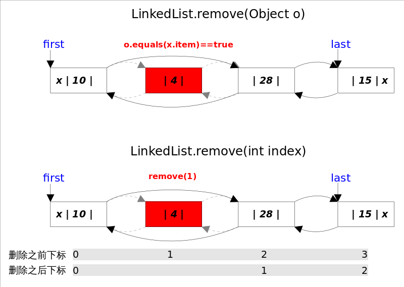

# JDK版本

> JDK 1.8.0_221

# 概述

*LinkedList*同时实现了*List*接口和*Deque*接口，也就是说它既可以看作一个顺序容器，又可以看作一个队列(*Queue*)，同时又可以看作一个栈(*Stack*)。这样看来，*LinkedList*简直就是个全能冠军。当你需要使用栈或者队列时，可以考虑使用*LinkedList*，一方面是因为Java官方已经声明不建议使用*Stack*类，更遗憾的是，Java里根本没有一个叫做*Queue*的类(它是个接口名字)。关于栈或队列，现在的首选是*ArrayDeque*，它有着比*LinkedList*(当作栈或队列使用时)有着更好的性能。


*LinkedList*的实现方式决定了所有跟下标相关的操作都是线性时间，而在首段或者末尾删除元素只需要常数时间。为追求效率*LinkedList*没有实现同步(synchronized)，如果需要多个线程并发访问，可以先采用`Collections.synchronizedList()`方法对其进行包装。

# LinkedList内部实现

## 底层数据结构

*LinkedList*底层**通过双向链表实现**，本节将着重讲解插入和删除元素时双向链表的维护过程，也即是直接跟*List*接口相关的函数，而将*Queue*和*Stack*以及*Deque*相关的知识放在下一节讲。双向链表的每个节点用内部类*Node*表示。*LinkedList*通过`first`和`last`引用分别指向链表的第一个和最后一个元素。注意这里没有所谓的哑元，当链表为空的时候`first`和`last`都指向`null`。

```java
    transient int size = 0;

    /**
     * Pointer to first node.
     * Invariant: (first == null && last == null) ||
     *            (first.prev == null && first.item != null)
     */
    transient Node<E> first;

    /**
     * Pointer to last node.
     * Invariant: (first == null && last == null) ||
     *            (last.next == null && last.item != null)
     */
    transient Node<E> last;
```

Node是内部私有的静态类

```java
    private static class Node<E> {
        E item;
        Node<E> next;
        Node<E> prev;

        Node(Node<E> prev, E element, Node<E> next) {
            this.item = element;
            this.next = next;
            this.prev = prev;
        }
    }
```

## Constructor

```java
    /**
     * Constructs an empty list.
     */
    public LinkedList() {
    }

    /**
     * Constructs a list containing the elements of the specified
     * collection, in the order they are returned by the collection's
     * iterator.
     *
     * @param  c the collection whose elements are to be placed into this list
     * @throws NullPointerException if the specified collection is null
     */
    public LinkedList(Collection<? extends E> c) {
        this();
        addAll(c);
    }
```

## add()

add()方法有两个版本，一个是`add(E e)`，该方法在LinkedList的末尾插入元素，因为有`last`指向链表末尾，在末尾插入元素的花费是常数时间。只需要简单修改几个相关引用即可；另一个是`add(int index, E element)`，该方法是在指定下表处插入元素，需要先通过线性查找找到具体位置，然后修改相关引用完成插入操作。


### add(E e)

```java
    /**
     * Appends the specified element to the end of this list.
     *
     * <p>This method is equivalent to {@link #addLast}.
     *
     * @param e element to be appended to this list
     * @return {@code true} (as specified by {@link Collection#add})
     */
    public boolean add(E e) {
        linkLast(e);
        return true;
    }

    /**
     * Links e as last element.
     */
    void linkLast(E e) {
        final Node<E> l = last;
        final Node<E> newNode = new Node<>(l, e, null);
        last = newNode;
        if (l == null) // 链表为空
            first = newNode; // 插入到第一个元素
        else
            l.next = newNode;
        size++;
        modCount++;
    }
```

### add(int index, E element)

`add(int index, E element)`的逻辑稍显复杂，可以分成两部分，1.先根据index找到要插入的位置；2.修改引用，完成插入操作。

```java
    /**
     * Inserts the specified element at the specified position in this list.
     * Shifts the element currently at that position (if any) and any
     * subsequent elements to the right (adds one to their indices).
     *
     * @param index index at which the specified element is to be inserted
     * @param element element to be inserted
     * @throws IndexOutOfBoundsException {@inheritDoc}
     */
    public void add(int index, E element) {
        checkPositionIndex(index); // 检测插入位置是否超出LinkedList的数组大小

        if (index == size) // 插入到末尾
            linkLast(element);
        else
            linkBefore(element, node(index)); // 插入到指定位置
    }
    
     /**
     * Returns the (non-null) Node at the specified element index.
     */
    Node<E> node(int index) {
        // assert isElementIndex(index);

        if (index < (size >> 1)) {
            Node<E> x = first;
            for (int i = 0; i < index; i++)
                x = x.next;
            return x;
        } else {
            Node<E> x = last;
            for (int i = size - 1; i > index; i--)
                x = x.prev;
            return x;
        }
    }
```

上面代码中的`node(int index)`函数有一点小小的trick，因为链表双向的，可以从开始往后找，也可以从结尾往前找，具体朝那个方向找取决于条件`index < (size >> 1)`，也即是index是靠近前端还是后端。从这里也可以看出，linkedList通过index检索元素的效率没有arrayList高。

## remove()

`remove()`方法也有两个版本，一个是删除跟指定元素相等的第一个元素`remove(Object o)`，另一个是删除指定下标处的元素`remove(int index)`。



两个删除操作都要

1.先找到要删除元素的引用，

2.修改相关引用，完成删除操作。

在寻找被删元素引用的时候`remove(Object o)`调用的是元素的`equals`方法，而`remove(int index)`使用的是下标计数，两种方式都是线性时间复杂度。在步骤2中，两个`remove()`方法都是通过`unlink(Node<E> x)`方法完成的。这里需要考虑删除元素是第一个或者最后一个时的边界情况。

```java
    /**
     * Removes the element at the specified position in this list.  Shifts any
     * subsequent elements to the left (subtracts one from their indices).
     * Returns the element that was removed from the list.
     *
     * @param index the index of the element to be removed
     * @return the element previously at the specified position
     * @throws IndexOutOfBoundsException {@inheritDoc}
     */
    public E remove(int index) {
        checkElementIndex(index);
        return unlink(node(index));
    }

    /**
     * Removes the first occurrence of the specified element from this list,
     * if it is present.  If this list does not contain the element, it is
     * unchanged.  More formally, removes the element with the lowest index
     * {@code i} such that
     * <tt>(o==null&nbsp;?&nbsp;get(i)==null&nbsp;:&nbsp;o.equals(get(i)))</tt>
     * (if such an element exists).  Returns {@code true} if this list
     * contained the specified element (or equivalently, if this list
     * changed as a result of the call).
     *
     * @param o element to be removed from this list, if present
     * @return {@code true} if this list contained the specified element
     */
    public boolean remove(Object o) {
        if (o == null) {
            for (Node<E> x = first; x != null; x = x.next) {
                if (x.item == null) {
                    unlink(x);
                    return true;
                }
            }
        } else {
            for (Node<E> x = first; x != null; x = x.next) {
                if (o.equals(x.item)) {
                    unlink(x);
                    return true;
                }
            }
        }
        return false;
    }

    /**
     * Unlinks non-null node x.
     */
    E unlink(Node<E> x) {
        // assert x != null;
        final E element = x.item;
        final Node<E> next = x.next;
        final Node<E> prev = x.prev;

        if (prev == null) { // 删除第一个元素
            first = next;
        } else {
            prev.next = next;
            x.prev = null;
        }

        if (next == null) { // 删除最后一个元素
            last = prev;
        } else {
            next.prev = prev;
            x.next = null;
        }

        x.item = null; // GC
        size--;
        modCount++;
        return element;
    }
```

## get()

`get(int index)`得到指定下标处元素的引用，通过调用上文中提到的`node(int index)`方法实现。

```java
    /**
     * Returns the element at the specified position in this list.
     *
     * @param index index of the element to return
     * @return the element at the specified position in this list
     * @throws IndexOutOfBoundsException {@inheritDoc}
     */
    public E get(int index) {
        checkElementIndex(index);
        return node(index).item;
    }
```


## set()

`set(int index, E element)`方法将指定下标处的元素修改成指定值，也是先通过`node(int index)`找到对应下表元素的引用，然后修改`Node`中`item`的值。

```java
    /**
     * Replaces the element at the specified position in this list with the
     * specified element.
     *
     * @param index index of the element to replace
     * @param element element to be stored at the specified position
     * @return the element previously at the specified position
     * @throws IndexOutOfBoundsException {@inheritDoc}
     */
    public E set(int index, E element) {
        checkElementIndex(index);
        Node<E> x = node(index);
        E oldVal = x.item;
        x.item = element;
        return oldVal;
    }
```

# 参考

https://github.com/CarpenterLee/JCFInternals/blob/master/markdown/3-LinkedList.md

https://www.pdai.tech/md/java/collection/java-collection-LinkedList.html
